# Introduction
In this homework, you'll be implementing a **Binomial Heap** in C++. Each Binomial Heap consists of some **Nodes**.

# Node Class
This class represents each Node. It has the following method and member variables.

```c++
class Node{
    public:
        double value;
        Node* parent;
        std::list<Node*> children;
        Node();
        Node(double);
        Node(double value, Node parent, std::list<Node*> children);
        size_t get_order();
        void set_order(size_t count);
    private:
        size_t order=0;
};
```

Each Node represents a number and has a pointer to parent Node and some children Node that stored their pointer in a list!

The initial values of value and parent must be 0 and null pointer.

The order of each node represent the depth of tree that this node is its root. for example order of Node(3) is 3(path 3,5,9 and 10) and order of Node(9) is 1(path 9 and 10). order of a single Node is 0!
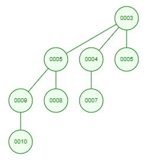

In addition above, this class has 3 other method that explain below!
```c++
Node* merge(Node*, Node*);
bool is_min_heap(Node);
bool is_max_heap(Node);
```
- The first one should merge two Node if they have same order, otherwise it must throw logic error!  Note that both Node will change after merging them. we assume that each node is min heap and our target is merging them in a way that the result be min heap. An example is here:

    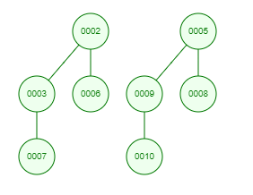
    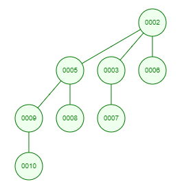

- The next two, get a Node and return true if the subtree that this node is its root be min/max heap. for example in first image Node(5) is root of a min heap beacuse ```5<8, 5<9 and 9<10```. For other example, in image below:

    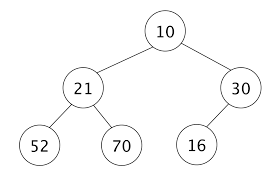

    Node(21), Node(52), Node(70), Node(16) are max and min heap and Node(30) is max heap. Nota that Node(10) is **Not** min heap becaues each subtree of a min heap tree must be min heap!

Note that these 3 methods must be accessible without creating instance of Node!

And at the end this code should work as expected!
```c++
BionomialHeap::Node n1(1);
BionomialHeap::Node n2(2);
std::cout<< n1 << std::endl     // print "(value:1, parent: , order:0)"
                                // if parent=null pointer, parnet show empty 
                                // otherwise show its value.
std::cout<< (n2>n1) << std::endl; // True, Nodes must be comparable by their values.
std::cout<< (n2>3) << std::endl;  // Error
```

# BinomialHeap Class
This class represents our Binomial Heap. It has the following method and member variables.

```c++
class BinomialHeap{
    public:
        class Node{
        };    // explained above
        BinomialHeap();
        BinomialHeap(const BinomialHeap&);
        ~BinomialHeap();
        BinomialHeap operator=(const BinomialHeap&);
        BinomialHeap* insert(double);
        BinomialHeap* insert(Node*);
        double pop();    // return the minimum Node of binomial heap
        bool empty();
        void clear();    // remove all Nodes!
        void show();
        size_t get_roots_length();
        size_t get_length();
        void merge(const BinomialHeap&);
    private:
        size_t N=0;    // number of Nodes in binomial heap
};
```
Some explanation about method insert(Node*):
Look this binomial heap.
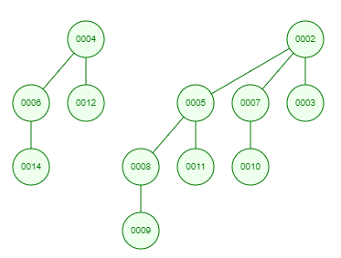
If we remove smallest Node(Node 2) by calling method pop(), our heap convert to this:
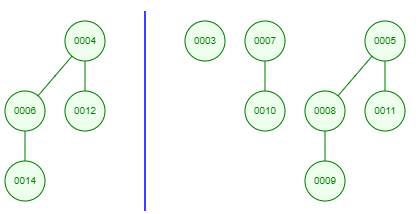
So we must insert out root Nodes one by one so we you this method to do that.
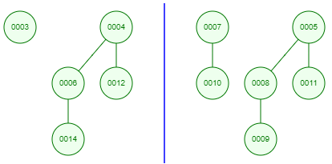
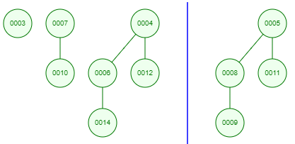
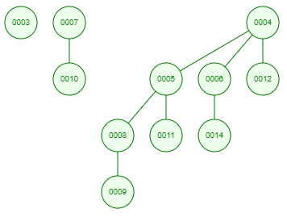

**Note:** If N=0 and call method pop(), you should throw logic error!
**Note:** You must not remove any keyword in these methods:
```c++
BinomialHeap(const BinomialHeap&);
BinomialHeap operator=(const BinomialHeap&);
void merge(const BinomialHeap&);
```
In addition of above, we have some method and variables that explain below.
- roots: This private variable is a set of Node* that sorted by their order in ascending order.
- head: This public variable is an iterator that shows the begin of roots. 
- constructors:
  - The first argument is N that represent number of Nodes and the second one is a function that determine value of ```i-th``` Nodes(```0<i<N+1```) 
  - The code below must run!
    ```c++
    BinomialHeap bh1{10,20,30,40,50,60,70};
    ```
    Check Test5 for more details.
    
And at the end, the code below must works!
```c++
BinomialHeap bh{1,2,3,4,5,6,7,8,9,10};
bh[3] = 12;
```
This means that the you should search in roots and find the Node that its order is 3 and set its value to 12. If there is not any Node with order 3, you should change the begining Node of roots but you should convert the new heap to min heap. So you should swap the value of the Node with its minimum children when the new value be greater than at least one children and continue this way for its children. for example consider previous image! if we run bh[3]=14, so we have:
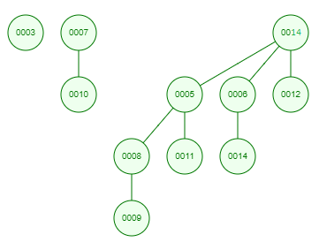
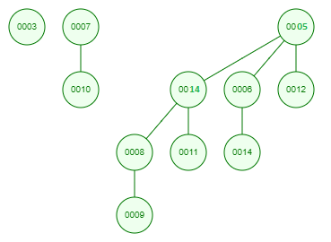
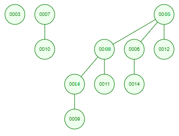
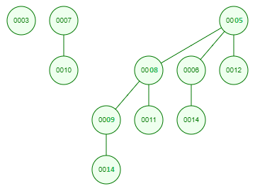

# main File
You must not alter the **main.cpp** file at all. Just write all your codes in the **binomialheap** header and cpp files. Good luck!
